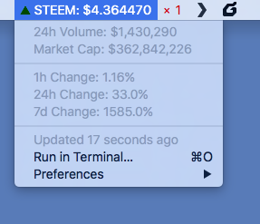

# STEEM BitBar Plugin

Get the current STEEM value in your OS X Menu Bar

## Installation

Download and install [BitBar](https://getbitbar.com/) and copy `steem.5m.rb` into your BitBar's plugin folder.
