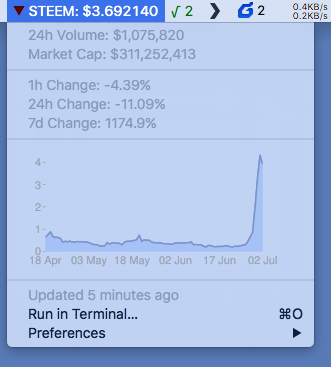
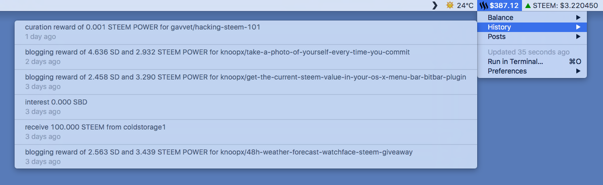

# STEEM BitBar Plugin

Get the current STEEM value in your OS X Menu Bar

# STEEM Wallet BitBar Plugin

Get your STEEM wallet details in your OS X Menu Bar

This plugin requires `nokogiri` to be installed, install it by running `sudo gem install nokogiri` from the command line.

## Installation

Download and install [BitBar](https://getbitbar.com/) and copy `steem.5m.rb` and `steemit.profile.30s.rb` into your BitBar's plugin folder.
Make sure they are executable `chmod +x steem.5m.rb steemit.profile.30s.rb` if you get "Launch path not accessible" error.
